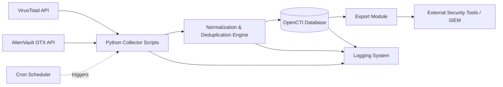

# 🛡️ Holberton School — Threat Intelligence Platform

<div align="center">


### Automated, centralized OSINT threat intelligence collection & ingestion pipeline

*Aggregating IOCs from public threat feeds into a structured, continuously updated database for security teams.*

</div>

---

## 📖 Table of Contents

- [Overview](#-overview)
- [Key Features](#-key-features)
- [Architecture](#-architecture)
- [Tech Stack](#-tech-stack)
- [Project Structure](#-project-structure)
- [Installation](#-installation)
- [Configuration](#-configuration)
- [Usage](#-usage)
- [Scheduling with Cron](#-scheduling-with-cron)
- [Logging](#-logging)
- [Data Export](#-data-export)
- [Roadmap](#-roadmap)
- [Contributing](#-contributing)
- [License](#-license)
- [Authors](#-authors)

---

## 🎯 Overview

This project builds a **centralized platform for automating cyber threat intelligence (CTI) collection** from public OSINT sources. It combines **OpenCTI** with custom-built **Python scripts** to create a continuous, structured data ingestion pipeline for security teams.

The system integrates with public threat intelligence APIs — **VirusTotal** and **AlienVault OTX** — to automatically pull **Indicators of Compromise (IOCs)** such as IPs, domains, and file hashes. Data collection is fully automated via **Python + Cron**, with all results normalized and centralized inside an **OpenCTI** database for analysis.

> Built as a Holberton School project to demonstrate practical skills in cybersecurity automation, API integration, and data pipeline engineering.

---

## ✨ Key Features

| # | Feature | Description |
|---|---------|-------------|
| 1 | 🔌 **Multi-source IOC extraction** | Pulls IPs, domains, and hashes from VirusTotal, AlienVault OTX, and other APIs |
| 2 | ⏱️ **Automated scheduling** | Python scripts run unattended via Cron jobs on a defined interval |
| 3 | 🧹 **Data normalization & dedup** | Cleans, standardizes, and removes duplicate IOCs before storage |
| 4 | 📝 **Full logging** | Every API call, error, and successful operation is logged systematically |
| 5 | 📤 **Data export** | Collected IOC datasets can be exported for use in external security tools |
| 6 | 🗄️ **OpenCTI integration** | All processed intel is centralized in OpenCTI for analyst-ready use |

---

## 🏗️ Architecture



**Flow summary:**
1. Cron triggers Python collector scripts on a schedule.
2. Scripts query VirusTotal & AlienVault OTX APIs for fresh IOC data.
3. Raw data is normalized and deduplicated.
4. Clean IOCs are ingested into OpenCTI.
5. Data can be exported to external security systems.
6. Every step is logged for auditability.

---

## 🧰 Tech Stack

- **Language:** Python 3.10+
- **Threat Intel Platform:** [OpenCTI](https://www.opencti.io/)
- **APIs:** VirusTotal API, AlienVault OTX API
- **Scheduling:** Cron
- **Data handling:** `requests`, `pandas` (or similar)
- **Logging:** Python `logging` module
- **Database:** OpenCTI's internal store (Elasticsearch/MinIO/Redis backend)

---

## 📂 Project Structure

```
holbertonschool-threat-intelligence-platform/
├── collectors/
│   ├── virustotal_collector.py
│   ├── otx_collector.py
│   └── base_collector.py
├── processing/
│   ├── normalizer.py
│   └── deduplicator.py
├── opencti_client/
│   └── ingest.py
├── export/
│   └── exporter.py
├── logs/
│   └── pipeline.log
├── cron/
│   └── crontab_example.txt
├── .env.example              # committed — placeholder values only
├── .env                       # git-ignored, holds your real keys
├── .gitignore
├── requirements.txt
└── README.md
```

---

## ⚙️ Installation

```bash
# Clone the repository
git clone https://github.com/RamzitheStudent/holbertonschool-threat-intelligence-platform.git
cd holbertonschool-threat-intelligence-platform

# Create a virtual environment
python3 -m venv venv
source venv/bin/activate

# Install dependencies
pip install -r requirements.txt
```

---

## 🔑 Configuration

> ⚠️ **Security note:** Real API keys and tokens must **never** be committed to the repository. This repo uses an `.env.example` file — a template with placeholder values that IS committed — while the real `.env` file (with actual secrets) is git-ignored and stays local only.

**1. Copy the example environment file:**

```bash
cp .env.example .env
```

**2. Fill in your own credentials in `.env`** (this file stays local only, never pushed to GitHub):

```env
VIRUSTOTAL_API_KEY=YOUR_VIRUSTOTAL_API_KEY
OTX_API_KEY=YOUR_OTX_API_KEY
OPENCTI_URL=YOUR_OPENCTI_INSTANCE_URL
OPENCTI_TOKEN=YOUR_OPENCTI_TOKEN
```

**3. Verify `.env` is git-ignored** (it already is, via the standard `.env` rule in `.gitignore`):

```bash
git check-ignore -v .env
# should print the .gitignore rule matching it
```

Only `.env.example` (with placeholder values, no real secrets) should ever be committed — it exists so teammates know which variables to set without ever seeing real credentials.

---

## ▶️ Usage

Run a single collection cycle manually:

```bash
python3 collectors/virustotal_collector.py
python3 collectors/otx_collector.py
```

Run the full pipeline (collect → normalize → dedup → ingest):

```bash
python3 main.py --run-pipeline
```

Export collected IOCs:

```bash
python3 export/exporter.py --format csv --output iocs_export.csv
```

---

## ⏰ Scheduling with Cron

Example crontab entry to run the pipeline every hour:

```bash
0 * * * * /path/to/venv/bin/python3 /path/to/holbertonschool-threat-intelligence-platform/main.py --run-pipeline >> /path/to/logs/cron.log 2>&1
```

To install:

```bash
crontab -e
# paste the line above, save and exit
```

---

## 📝 Logging

All operations are logged to `logs/pipeline.log`, including:

- ✅ Successful API requests and ingestion events
- ⚠️ Failed/retried API calls
- 🔁 Duplicate records skipped
- 🧾 Summary statistics per run

Example log entry:
```
2026-08-18 09:00:01 [INFO] VirusTotal: 145 IOCs fetched
2026-08-18 09:00:03 [WARNING] OTX API rate limit reached, retrying in 30s
2026-08-18 09:00:45 [INFO] 12 duplicate IOCs removed
2026-08-18 09:00:47 [INFO] 133 IOCs ingested into OpenCTI
```

---

## 📤 Data Export

The export module allows security teams to pull IOC data out for use in external tools (SIEM, firewalls, threat feeds):

| Format | Command |
|--------|---------|
| CSV | `python3 export/exporter.py --format csv` |
| JSON | `python3 export/exporter.py --format json` |
| STIX 2.1 | `python3 export/exporter.py --format stix` |

---

## 🗺️ Roadmap

- [ ] Add MISP integration as an additional feed source
- [ ] Web dashboard for pipeline monitoring
- [ ] Slack/Telegram alerting on new critical IOCs
- [ ] Docker Compose setup for one-command deployment

---

## 🤝 Contributing

This is a private, team-based Holberton School project. All changes go through pull requests and require at least one approving review before merging into `main`.

```bash
git checkout -b feature/your-feature
git commit -m "Add your feature"
git push origin feature/your-feature
```

Then open a pull request on GitHub and request a review from a teammate.

---

## 📄 License

**No License.** This repository does not include an open-source license.

All rights are reserved by the authors

---

## 👥 Authors

- **[RamzitheStudent](https://github.com/RamzitheStudent)**
- **[Amir606800](https://github.com/Amir606800)**
- **[mhroya](https://github.com/mhroya)**
- **[ii0784165-byte](https://github.com/ii0784165-byte)**

<div align="center">

⭐ Internal team project — Holberton School

</div>
